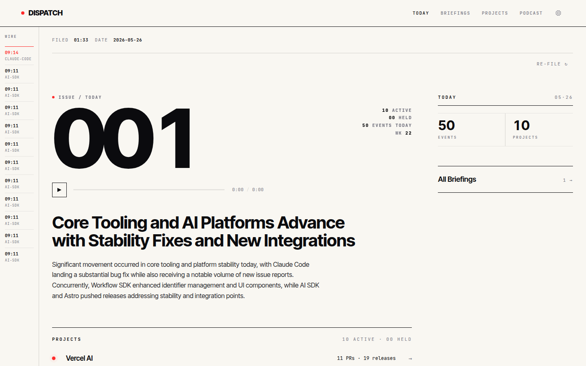

# Dispatch

[](LICENSE)
[](docker-compose.yml)
[](https://dispatch-demo.markdavidgan.com)

> A standalone, self-hosted **daily editorial brief generator** and **AI podcast creator**
> for software projects. Dispatch watches GitHub repositories, automatically synthesizes
> a **daily developer digest** with audio narration (TTS), and publishes a **weekly
> podcast** via NotebookLM — turning repo noise into editorial signal.
>
> Think of it as a self-hosted **developer newsletter** or **AI changelog** that reads
> itself to you.

**Live demo:** [dispatch-demo.markdavidgan.com](https://dispatch-demo.markdavidgan.com) —
a public instance watching `anthropics/claude-code`, `withastro/astro`,
`Shopify/hydrogen`, `Netflix/metaflow`, `Netflix/mantis`, `vercel/ai`,
`vercel/workflow`, `google/gemma.cpp`, and this repo itself (`markdavidgan/dispatch`).



Dispatch is deliberately built as a **single-admin per instance, perimeter-trusting**
application — no users table, no login page, no JWTs. Authentication lives at the
deployment perimeter (Cloudflare Access, Tailscale, Caddy basic auth, Authelia, etc.).
The only required environment variable is `DISPATCH_MASTER_KEY`; every other credential
is configured through the admin UI and encrypted at rest.

---

## Architecture at a glance

| Layer       | Stack                                                                   |
| ----------- | ----------------------------------------------------------------------- |
| Frontend    | Vite + React 19 + Tailwind CSS v4 + React Router (static SPA build)     |
| Backend     | FastAPI + Python 3.13 + aiosqlite (SQLite in WAL mode)                  |
| Scheduler   | In-process APScheduler — no Redis, no Celery                            |
| Storage     | Pluggable: local filesystem, Cloudflare R2, or S3-compatible            |
| AI          | Configurable providers — Kimi, Anthropic, OpenAI                        |
| TTS         | Google Cloud Chirp 3 HD (extension points for Cartesia / ElevenLabs)    |
| Reverse proxy | Caddy (ships in `docker-compose.yml`); any HTTP proxy works           |
| Perimeter   | Deployment-layer auth — see `docs/operations/perimeter-recipes.md`      |

**Two deployment modes:**

- **All-in-One Docker** (recommended for self-hosting) — everything in a single
  `docker compose up`. Caddy serves the SPA and reverse-proxies to the FastAPI
  backend. SQLite + APScheduler run in-process.
- **Hybrid** — Vercel serverless for the SPA, ingest, synthesis, and admin APIs;
  self-hosted backend for TTS and podcasts. See
  [`docs/architecture/DEPLOYMENT.md`](docs/architecture/DEPLOYMENT.md) for the
  full split.

For full diagrams and a layer-by-layer walkthrough, see **[docs/architecture/](docs/architecture/)**.

---

## Documentation

| Doc                                                                  | What it covers                                                                  |
| -------------------------------------------------------------------- | ------------------------------------------------------------------------------- |
| [`docs/architecture/`](docs/architecture/)                           | System architecture, data flow, deployment patterns, interactive HTML diagram   |
| [`DESIGN.md`](DESIGN.md)                                             | The editorial design system (typography, palette, layout invariants)            |
| [`docs/operations/perimeter-recipes.md`](docs/operations/perimeter-recipes.md) | Concrete perimeter-auth recipes for Cloudflare Access, Tailscale, Caddy, Authelia |
| [`docs/brainstorm/`](docs/brainstorm/)                               | Architecture brainstorms (design history — useful context, not specification)   |

---

## Repository layout

```
dispatch/
├── apps/
│   ├── frontend/      # Vite SPA — static build
│   │   └── api/       # Vercel serverless API routes (hybrid mode only)
│   └── backend/       # FastAPI app — Docker, encrypted settings, pluggable storage
├── caddy/             # Default reverse-proxy config (used by docker-compose)
├── docker-compose.yml # All-in-one stack (backend + caddy-served SPA)
├── docs/              # Architecture, design, operations, brainstorms
├── CLAUDE.md          # Repository-level agent instructions (internal)
├── DESIGN.md          # Editorial design system
└── README.md          # You are here
```

---

## Quick start

Every common task is wrapped in a `make` target. Run `make` (with no arguments)
to see the menu.

### One-command bring-up (recommended)

```bash
make bootstrap
```

That generates a `DISPATCH_MASTER_KEY` into `.env` if you don't have one,
brings up the docker compose stack, waits for the backend to report healthy,
then triggers an ingest + look-back synthesis backfill against the example
projects shipped in `apps/backend/dispatch/projects.yml`.

Visit:

- `http://localhost:8080/` — SPA
- `http://localhost:8080/health` — backend health
- `http://localhost:8080/api/projects` — backend API

Override the host port with `DISPATCH_HTTP_PORT=80`.

> Note: brief *generation* requires an AI provider key (Kimi, Anthropic, or
> OpenAI). The bootstrap script ingests events and primes the catch-up loop,
> but the first narrated brief only appears once you add a provider key under
> `/admin/settings` and re-run the backfill from `/admin` (or `make backfill`).

### Day-to-day

```bash
make up         # build + start the stack in the background
make logs       # tail logs from all services
make down       # stop (keeps volumes)
make nuke       # stop AND delete volumes (destructive — wipes the DB)
make backfill   # POST /api/admin/system/backfill against the running stack
make key        # print a fresh DISPATCH_MASTER_KEY
```

### Local dev (no Docker)

```bash
make install    # venv + pip install backend, npm install frontend
make dev        # backend (uvicorn --reload) + frontend (vite) together
```

Or run them individually with `make dev-backend` / `make dev-frontend`. The
Vite dev server runs on `http://localhost:5173` and proxies `/api/*` and
`/health` to `http://127.0.0.1:10060`. For backend env, copy
`apps/backend/.env.example` → `apps/backend/.env` and set `DISPATCH_MASTER_KEY`
(use `make key` to generate one).

### Tests & quality

```bash
make test       # backend pytest suite
make test-e2e   # frontend Playwright e2e
make lint       # frontend Biome
make format     # frontend Biome format
make typecheck  # frontend TypeScript
make build      # production SPA build
```

> The backend currently uses pytest for tests. Python linting and type-checking
> tooling (e.g. Ruff, mypy) are not yet configured — see
> [`docs/architecture/ARCHITECTURE.md`](docs/architecture/ARCHITECTURE.md) for
> the current code-quality setup.

### Manual Docker bring-up

If you prefer to drive `docker compose` directly:

```bash
export DISPATCH_MASTER_KEY=$(make key)
docker compose up --build
```

The stack is two services:

- `dispatch-backend` — FastAPI on **internal** port 10060 (not published).
- `dispatch-frontend` — Caddy serving the Vite SPA and reverse-proxying
  `/api/*` and `/health` to the backend.

---

## Key management

The single required env var is `DISPATCH_MASTER_KEY`. This key encrypts every
credential the app holds at rest (AI provider keys, TTS credentials, GitHub
tokens, storage credentials, NotebookLM session).

**If you lose this key, the encrypted settings are unrecoverable** and you will
need to re-enter them via the admin UI. Briefings, audio, snapshots, and project
configuration are unaffected. Back the key up in a password manager.

Generate one with:

```bash
python -c "import secrets; print(secrets.token_urlsafe(32))"
```

To rotate, use the admin endpoint:

```
POST /api/admin/system/rotate-key
{ "old_key": "...", "new_key": "..." }
```

---

## Authentication model

Dispatch does **not** implement application-level authentication. The backend trusts
its deployment perimeter — Cloudflare Access, Tailscale, a reverse-proxy basic-auth
block, Authelia, or any equivalent.

Route prefixes are designed so any perimeter can apply policy:

- `/admin/*` and `/api/admin/*` — operator-only; **must** be gated.
- `/`, `/briefings/*`, `/podcasts/*`, `/api/snapshot` — public reader paths; gate
  these too if you want a fully private instance.

Recipes for the common perimeter patterns live in
[`docs/operations/perimeter-recipes.md`](docs/operations/perimeter-recipes.md).

---

## Configuring your own projects

The shipped `apps/backend/dispatch/projects.yml` registers several showcase
projects (including `anthropics/claude-code`, `withastro/astro`, and this
repository, `markdavidgan/dispatch`) so a fresh clone has something to summarize.
After your first boot, either:

- Edit `projects.yml` directly and restart, **or**
- Use the admin UI at `/admin/projects` to CRUD projects at runtime.

See the comments at the top of `projects.yml` for the full schema.

## Weekly podcasts

Dispatch ships with one podcast enabled by default — **Dispatch Weekly**, a
dispatch-wide cross-project digest. Every Saturday morning (5:00 UTC), the
scheduler picks up the past seven days of curated lead briefings and hands
them to NotebookLM, which composes a single 25–30 minute conversational
episode surfacing themes that span projects rather than reciting per-day
activity.

To enable per-project podcasts (one weekly episode per tracked repo) edit the
`podcast:` block on the relevant project entry in `projects.yml` and set
`enabled: true`.

Manual trigger (e.g. after editing the registry):

```
POST /api/admin/podcasts/dispatch-weekly/compose
```

A preview of the markdown that will be sent to NotebookLM is available at
`GET /api/admin/podcasts/{slug}/preview-source` — handy for tuning the source
template without burning compose credits.

> Episode generation requires a NotebookLM session token in
> `podcast.notebooklm_session` (admin Settings). Without it the compose job
> runs through to the upload step and records `skipped` in the episodes table.

## Backfill and catch-up

The daily synthesis job follows a small priority chain:

1. If yesterday is uncovered and had activity, generate yesterday's brief.
2. Otherwise, find the oldest uncovered day with activity in the last 30 days
   and generate that one (catch-up).
3. Otherwise, skip (no work to do).

This means an instance that was offline for a week will catch up over the
following days, one brief per scheduler tick. To process the whole backlog
immediately (e.g. right after `bootstrap.sh`), hit:

```
POST /api/admin/system/backfill
{ "look_back_days": 30, "ingest": true }
```

The endpoint ingests fresh events, then loops the look-back synthesis until
every uncovered active day in the window has a brief (capped at `max_days`
iterations to prevent runaway).

---

## License

MIT
