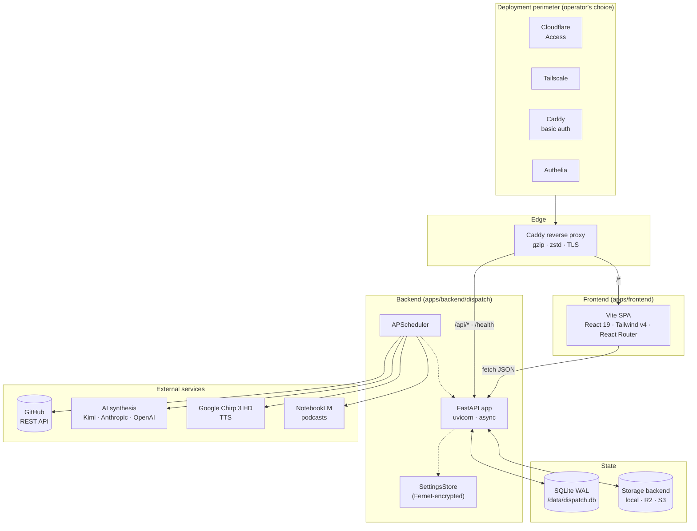
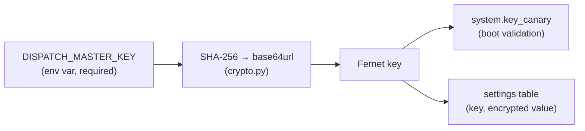
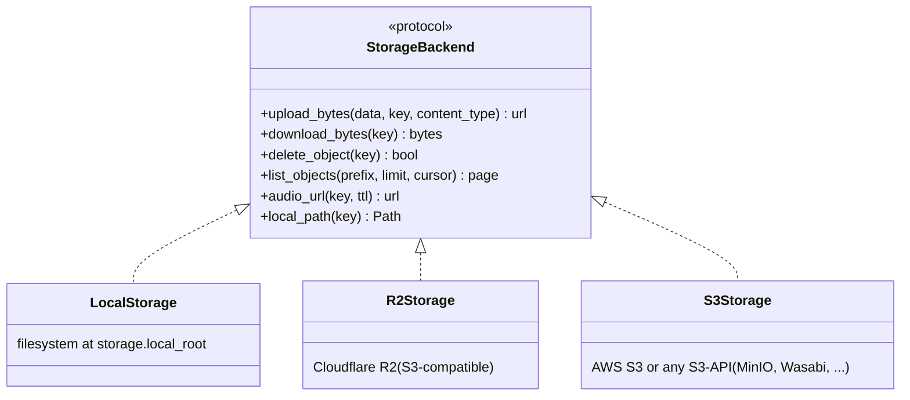

# Architecture

## System overview

Dispatch is a two-tier application — a Vite SPA frontend and a FastAPI backend —
designed to run behind any HTTP-level authentication perimeter. The backend is
self-contained: it holds its data in a single SQLite file, runs its own
scheduler in-process, and talks to swappable storage and AI/TTS providers via
narrow adapters.



## Components

### Frontend — `apps/frontend/`

| Concern | Choice | Notes |
| --- | --- | --- |
| Build tool | **Vite 6** | Static SPA build; output to `dist/` |
| Framework | **React 19** | Concurrent renderer; no server components |
| Routing | **React Router 7** | Client-side only; SPA fallback in Caddy and Vercel |
| Styling | **Tailwind CSS v4** | PostCSS pipeline; design tokens in `index.css` |
| State | Local + URL params | No global store needed at current scope |
| HTTP | `fetch` wrapper in `src/lib/api.ts` | Base from `VITE_DISPATCH_API_URL` or `/api` |

Admin routes (`/admin/*`) are client-side React routes that assume the perimeter
gates the matching `/api/admin/*` backend routes. If the perimeter is
misconfigured, the SPA loads but the API calls fail — there is no second-line
defense inside the app.

### Backend — `apps/backend/dispatch/`

| Module | Responsibility |
| --- | --- |
| `main.py` | FastAPI app + lifespan; bootstraps DB, settings, storage, scheduler |
| `api/` | Public and admin route handlers |
| `crypto.py` | Fernet key derivation from `DISPATCH_MASTER_KEY` |
| `settings_store.py` | Encrypted DB-backed settings (read/write/upsert) |
| `storage/` | Pluggable storage backends (`base.py` + `local.py` / `r2.py` / `s3.py`) |
| `ingest/` | GitHub REST and local-git event ingestion |
| `synthesis/` | AI-driven brief composition (Kimi / Anthropic / OpenAI) |
| `audio/` | TTS chunking + ffmpeg post-processing |
| `podcast/` | RSS feeds, NotebookLM episode composition, Cloudflare Worker proxy |
| `publish/` | Snapshot archive + audio publishing to storage |
| `registry/` | YAML project registry loader + display-name resolver |
| `scheduler.py` | APScheduler wiring (default cron schedules) |
| `system/` | Master-key canary, SQLite backup automation |
| `orchestrator.py` | Composes ingest → synthesis → publish for a single cycle |
| `schema.sql` | Idempotent SQLite schema |

### Persistence

Single SQLite file (`/data/dispatch.db` by default), opened in WAL mode via
`aiosqlite`. No ORM — handlers run raw SQL through `Database.cursor()`. The
schema is intentionally small enough to be hand-rolled and idempotent.

| Table | Purpose |
| --- | --- |
| `projects` | Project registry (slug PK, status, kind, podcast config) |
| `events` | Ingested commits, PRs, issues, releases (deduped by `external_id`) |
| `cursors` | Per-project ingest state (GitHub, local-git) |
| `filings` | Daily and weekly briefs (lead body, addendum, audio URLs) |
| `runs` | Job execution history (status, duration, error) |
| `episodes` | Podcast episodes (per project, weekly cadence) |
| `settings` | **Encrypted** credentials and config (key PK, value Fernet-encrypted) |
| `schedules` | Cron-style job schedules (editable at runtime) |
| `system` | Key canary for master-key validation on boot |

## Settings encryption



On boot the app:

1. Reads `DISPATCH_MASTER_KEY` (refuses to start without it).
2. Derives a Fernet key by hashing the master key with SHA-256 and
   base64url-encoding the digest.
3. Decrypts a known canary value from the `system` table to verify the key
   matches a previous boot. Mismatch = hard fail with a clear error.
4. Decrypts settings on demand through `SettingsStore`.

Rotating the master key re-encrypts every row in `settings` and updates the
canary. The endpoint:

```
POST /api/admin/system/rotate-key
{ "old_key": "...", "new_key": "..." }
```

## Route map

All backend routes live under `/api/*` except `/health`. The split between
public and admin is by **path prefix only** — the app does not check who is
calling; the perimeter does.

### Public (perimeter-gated for private instances; otherwise readable by anyone)

| Method | Path | Purpose |
| --- | --- | --- |
| GET | `/health` | Liveness; used by Docker healthcheck and Caddy |
| GET | `/api/live` | Stats for the home page (commits in 7d, open PRs, last commit) |
| GET | `/api/projects` | Project registry (slug, name, status, kind) |
| GET | `/api/snapshot` | Current signed snapshot JSON (brief, projects, addendum) |
| GET | `/api/briefings` | Paginated past briefings |
| GET | `/api/briefings/{date}` | Single archived briefing |
| GET | `/api/podcasts` | Podcasts with episode counts and feed URLs |
| GET | `/api/podcasts/{slug}/episodes` | Episodes for one podcast |
| GET | `/api/audio/{key}` | MP3 stream (presigned R2/S3 URL or local FileResponse) |
| POST | `/api/brief/refresh` | On-demand addendum synthesis (timeout 25 s) |

### Admin — `/api/admin/*` (must be perimeter-gated)

| Method | Path | Purpose |
| --- | --- | --- |
| GET/POST | `/api/admin/projects` | List · create |
| GET/PATCH/DELETE | `/api/admin/projects/{slug}` | Read · update · delete |
| POST | `/api/admin/projects/reorder` | Batch reorder |
| GET | `/api/admin/settings` | List all settings (decrypted, optional prefix filter) |
| GET/PUT/DELETE | `/api/admin/settings/{key}` | CRUD a single setting |
| POST | `/api/admin/settings/bulk` | Bulk upsert |
| GET | `/api/admin/schedules` | List job schedules |
| GET/PATCH | `/api/admin/schedules/{job_name}` | Read · update cron or enabled flag |
| GET | `/api/admin/runs` | Job execution history (filter by `job_name`, `status`) |
| GET | `/api/admin/system/setup-status` | First-boot wizard status |
| POST | `/api/admin/system/rotate-key` | Re-encrypt every setting under a new master key |
| POST | `/api/admin/system/backup-now` | Trigger an immediate SQLite backup |

## Pluggable storage



Backend is selected at boot by reading `storage.provider` from the encrypted
settings (`local` · `r2` · `s3`) and instantiating the corresponding class via
`storage/__init__.py:get_storage_backend()`. Switching backends is a settings
edit + a restart — no code changes.

| Backend | Presigned URLs | Setup |
| --- | --- | --- |
| `local` | No (served via `FileResponse`) | Filesystem root only |
| `r2` | Yes | Cloudflare account, bucket, access keys, public base URL |
| `s3` | Yes | Endpoint, bucket, access keys, region, public base URL |

## Scheduler

APScheduler runs in-process. Jobs are started in the FastAPI lifespan and
stopped on shutdown. Schedules are read from the `schedules` table on boot, so
operators can adjust cron expressions from the admin UI without redeploying.

| Job | Default cadence | Purpose |
| --- | --- | --- |
| `ingest_git` | every 15 min | Poll local git clones for new commits |
| `ingest_github` | every 30 min | Poll GitHub REST API for PRs, issues, releases |
| `synthesis_lead` | daily 02:00 | Compose the lead brief for yesterday's activity |
| `synthesis_from_the_desk` | weekly Sun 23:00 | Compose the weekly editor's memo |
| `podcast_intake` | weekly (per project) | NotebookLM episode composition |
| `housekeeping` | daily 03:30 | Cleanup and backup tasks |

Single-process scheduling is sufficient for the single-admin use case. If load
ever justified it, jobs could be lifted into Celery or RQ behind the same
adapters — but that is not on the current roadmap.

## Configuration matrix

| Concern | How it is set | Where it lives |
| --- | --- | --- |
| Master encryption key | `DISPATCH_MASTER_KEY` env var (required) | Environment only — never persisted |
| AI provider + key | Admin UI → `/admin/settings` | `settings` table (Fernet-encrypted) |
| TTS provider + key | Admin UI → `/admin/settings` | `settings` table |
| GitHub PAT | Admin UI or `.env` (legacy) | `settings` table |
| Storage backend + creds | Admin UI → `/admin/settings` | `settings` table |
| Project registry | `projects.yml` (bootstrap) + admin UI | `projects` table |
| Job schedules | Admin UI → `/admin/schedules` | `schedules` table |
| Timezone | `DISPATCH_TZ` env var | Environment (default `UTC`) |
| DB path | `DB_PATH` env var | Environment (default `/data/dispatch.db`) |
| Allowed CORS origins | Admin UI → `web.allowed_origins` | `settings` table |

## What is intentionally absent

- **No users / sessions / JWT.** Auth is at the perimeter.
- **No ORM.** Raw SQL through `aiosqlite`.
- **No Redis or Celery.** APScheduler in-process is enough.
- **No SSR / Next.js.** The reader pages render a JSON snapshot; the admin
  pages are perimeter-gated. Neither needs server rendering.
- **No multi-tenancy.** One instance, one operator.
- **No formal migration framework.** `schema.sql` is idempotent (CREATE TABLE
  IF NOT EXISTS). Schema changes that need data migration would warrant
  adding one.
