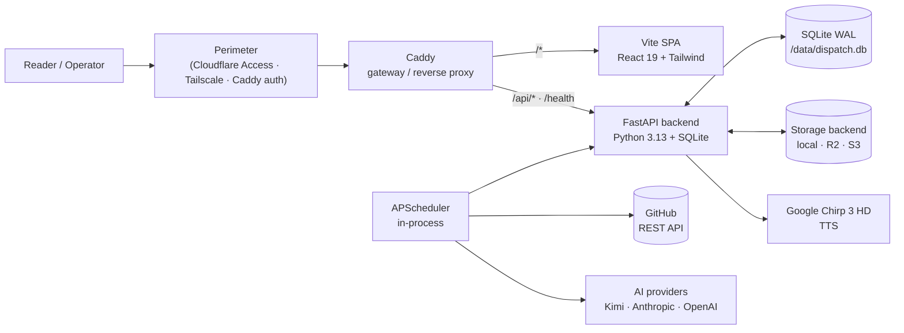
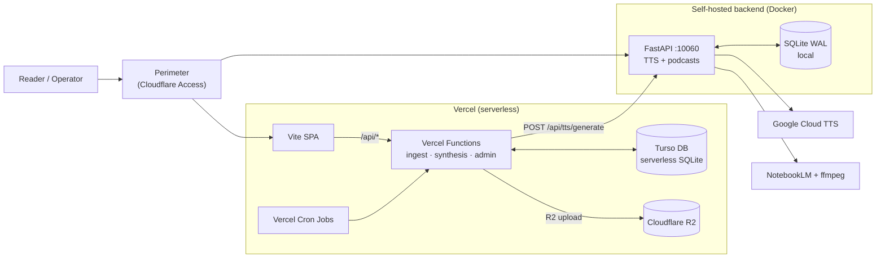
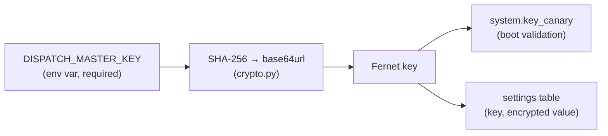
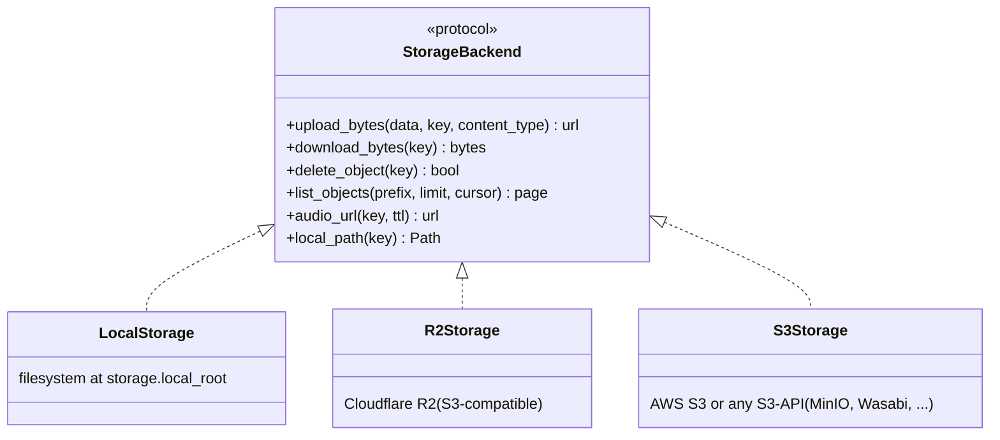

# Architecture

Dispatch is a single-admin, perimeter-trusting daily editorial brief generator.
It can run as an all-in-one Docker stack or be split across a serverless edge
(Vercel) and a self-hosted backend.

---

## Deployment modes

The same codebase supports two topologies. Choose based on your infrastructure
preferences.

### Mode A: All-in-One Docker (recommended for self-hosting)

A single `docker compose up` brings up the full stack:

- **Frontend** — Vite SPA served by Caddy
- **Backend** — FastAPI with SQLite (WAL mode) and APScheduler
- **Storage** — Local filesystem or S3-compatible (R2, MinIO, etc.)
- **TTS** — Google Cloud Chirp 3 HD (via backend)
- **Podcasts** — NotebookLM pipeline (via backend)



**Why this mode:** Simplest to operate. One container, one database, one
backup target. No external platform lock-in.

### Mode B: Hybrid — Vercel + Self-Hosted Backend

The frontend and briefings API run on Vercel (serverless), while TTS and
podcasts run on a self-hosted backend. Auth is provided by the surrounding
perimeter (e.g. Cloudflare Access).



**Why this mode:** The Vercel edge handles ingest and synthesis (stateless HTTP
calls to GitHub and AI providers), while the self-hosted box handles
long-running, resource-heavy work: TTS chunking, ffmpeg, and NotebookLM's
4-hour episode polling. The backend shrinks to "TTS + podcast worker" — the
Vercel tier owns the rest.

**Why the split exists:** Vercel serverless has no ffmpeg, no long-polling,
and tight execution limits. TTS and podcast pipelines need both. Rather than
find a new TTS provider that works serverless, Dispatch delegates audio work to
the self-hosted backend over HTTPS. See [ADR-001](adr/001-tts-on-marklab-backend.md).

---

## Components

### Frontend — `apps/frontend/src/`

| Concern | Choice | Notes |
| --- | --- | --- |
| Build tool | **Vite 6** | Static SPA build; output to `dist/` |
| Framework | **React 19** | Concurrent renderer; no server components |
| Routing | **React Router 7** | Client-side only; SPA fallback in Caddy and Vercel |
| Styling | **Tailwind CSS v4** | PostCSS pipeline; design tokens in `index.css` |
| State | Local + URL params | No global store needed at current scope |
| HTTP | `fetch` wrapper in `src/lib/api.ts` | Base from `VITE_DISPATCH_API_URL` or `/api` |

Admin routes (`/admin/*`) are client-side React routes that assume the perimeter
gates the matching `/api/admin/*` backend routes. If the perimeter is
misconfigured, the SPA loads but the API calls fail — there is no second-line
defense inside the app.

### Serverless API — `apps/frontend/api/` (Mode B only)

In the hybrid deployment, Vercel file-based API routes provide a serverless
backend that mirrors the Docker backend's public and admin surfaces. This is a
deployment-specific extraction: the same orchestration, ingest, synthesis, and
storage logic implemented as Vercel Functions.

| Module | Responsibility |
| --- | --- |
| `db.ts` | Turso (`@libsql/client`) wrapper |
| `crypto.ts` | AES-GCM encryption from `DISPATCH_MASTER_KEY` |
| `settings.ts` | Encrypted DB-backed settings store |
| `storage.ts` | R2 upload / download |
| `ingest-github.ts` | GitHub REST API event ingestion |
| `ingest-github-commits.ts` | Branch-aware commit ingestion |
| `synthesis/` | Prompt builders, schema definitions, mention extraction |
| `orchestrator.ts` | Composes ingest → synthesis → audio → publish |
| `snapshot.ts` | Snapshot builder + signer |
| `tts.ts` | Delegates to backend `POST /api/tts/generate` |

> **Design note:** The Vercel serverless API duplicates the backend's
> orchestration and ingest logic because Vercel Cron Jobs must invoke
> serverless functions. The Python backend remains the canonical
> implementation; the TypeScript API is a deployment adapter for serverless
> hosting. See [DEPLOYMENT.md](DEPLOYMENT.md) for how to avoid this entirely
> by running in all-in-one Docker mode.

### Backend — `apps/backend/dispatch/`

| Module | Responsibility |
| --- | --- |
| `main.py` | FastAPI app + lifespan; bootstraps DB, settings, storage, scheduler |
| `api/` | Public and admin route handlers |
| `api/tts.py` | TTS generation endpoint — serves the Vercel tier in hybrid mode |
| `crypto.py` | Fernet key derivation from `DISPATCH_MASTER_KEY` |
| `settings_store.py` | Encrypted DB-backed settings (read/write/upsert) |
| `storage/` | Pluggable storage backends (`base.py` + `local.py` / `r2.py` / `s3.py`) |
| `ingest/` | GitHub REST and local-git event ingestion |
| `synthesis/` | AI-driven brief composition (Kimi / Anthropic / OpenAI) |
| `audio/` | TTS chunking + ffmpeg post-processing |
| `podcast/` | RSS feeds, NotebookLM episode composition, Cloudflare Worker proxy |
| `publish/` | Snapshot archive + audio publishing to storage |
| `registry/` | YAML project registry loader + display-name resolver |
| `scheduler.py` | APScheduler wiring (default cron schedules) |
| `system/` | Master-key canary, SQLite backup automation |
| `orchestrator.py` | Composes ingest → synthesis → publish for a single cycle |
| `schema.sql` | Idempotent SQLite schema |

---

## Persistence

Single SQLite file (`/data/dispatch.db` by default in Docker; `./dispatch.db` in
dev), opened in WAL mode via `aiosqlite`. No ORM — handlers run raw SQL through
`Database.cursor()`. The schema is intentionally small enough to be hand-rolled
and idempotent.

In the hybrid deployment, the Vercel tier uses **Turso** (serverless SQLite over
HTTP) instead of local SQLite.

| Table | Purpose |
| --- | --- |
| `projects` | Project registry (slug PK, status, kind, podcast config) |
| `events` | Ingested commits, PRs, issues, releases (deduped by `external_id`) |
| `cursors` | Per-project ingest state (GitHub, local-git) |
| `filings` | Daily and weekly briefs (lead body, addendum, audio URLs) |
| `runs` | Job execution history (status, duration, error) |
| `episodes` | Podcast episodes (per project, weekly cadence) |
| `settings` | **Encrypted** credentials and config (key PK, value Fernet-encrypted) |
| `schedules` | Cron-style job schedules (editable at runtime) |
| `system` | Key canary for master-key validation on boot |

---

## Settings encryption



On boot the app:

1. Reads `DISPATCH_MASTER_KEY` (refuses to start without it).
2. Derives a Fernet key by hashing the master key with SHA-256 and
   base64url-encoding the digest.
3. Decrypts a known canary value from the `system` table to verify the key
   matches a previous boot. Mismatch = hard fail with a clear error.
4. Decrypts settings on demand through `SettingsStore`.

Rotating the master key re-encrypts every row in `settings` and updates the
canary. The endpoint:

```
POST /api/admin/system/rotate-key
{ "old_key": "...", "new_key": "..." }
```

Both deployment modes derive encryption keys from `DISPATCH_MASTER_KEY`
using SHA-256, but the algorithms differ: Docker uses Fernet (Python
`cryptography`) and the Vercel tier uses AES-GCM (Node.js `crypto`). The
ciphertext formats are **not interoperable** — each settings store is
independent.

---

## Route map

All backend routes live under `/api/*` except `/health`. The split between
public and admin is by **path prefix only** — the app does not check who is
calling; the perimeter does.

### Public (perimeter-gated for private instances; otherwise readable by anyone)

| Method | Path | Purpose |
| --- | --- | --- |
| GET | `/health` | Liveness; used by Docker healthcheck and Caddy |
| GET | `/api/live` | Stats for the home page (commits in 7d, open PRs, last commit) |
| GET | `/api/projects` | Project registry (slug, name, status, kind) |
| GET | `/api/snapshot` | Current signed snapshot JSON (brief, projects, addendum) |
| GET | `/api/briefings` | Paginated past briefings |
| GET | `/api/briefings/{date}` | Single archived briefing |
| GET | `/api/podcasts` | Podcasts with episode counts and feed URLs |
| GET | `/api/podcasts/{slug}/episodes` | Episodes for one podcast |
| GET | `/api/audio/{key}` | MP3 stream (presigned R2/S3 URL or local FileResponse) |
| POST | `/api/brief/refresh` | On-demand addendum synthesis (timeout 25 s) |
| POST | `/api/tts/generate` | Generate MP3 from text (delegates to Google Cloud TTS) |

### Admin — `/api/admin/*` (must be perimeter-gated)

| Method | Path | Purpose |
| --- | --- | --- |
| GET/POST | `/api/admin/projects` | List · create |
| GET/PATCH/DELETE | `/api/admin/projects/{slug}` | Read · update · delete |
| POST | `/api/admin/projects/reorder` | Batch reorder |
| GET | `/api/admin/settings` | List all settings (decrypted, optional prefix filter) |
| GET/PUT/DELETE | `/api/admin/settings/{key}` | CRUD a single setting |
| POST | `/api/admin/settings/bulk` | Bulk upsert |
| GET | `/api/admin/schedules` | List job schedules |
| GET/PATCH | `/api/admin/schedules/{job_name}` | Read · update cron or enabled flag |
| GET | `/api/admin/runs` | Job execution history (filter by `job_name`, `status`) |
| GET | `/api/admin/system/setup-status` | First-boot wizard status |
| POST | `/api/admin/system/rotate-key` | Re-encrypt every setting under a new master key |
| POST | `/api/admin/system/backup-now` | Trigger an immediate SQLite backup |
| POST | `/api/admin/system/backfill` | First-install ingest + synthesis backfill |
| POST | `/api/admin/briefings/generate` | Manually trigger a lead briefing |
| POST | `/api/admin/podcasts/{slug}/compose` | Trigger podcast compose for *slug* |
| GET | `/api/admin/podcasts/{slug}/preview-source` | Preview NotebookLM source markdown |

---

## Pluggable storage



Backend is selected at boot by reading `storage.provider` from the encrypted
settings (`local` · `r2` · `s3`) and instantiating the corresponding class via
`storage/__init__.py:get_storage_backend()`. Switching backends is a settings
edit + a restart — no code changes.

| Backend | Presigned URLs | Setup |
| --- | --- | --- |
| `local` | No (served via `FileResponse`) | Filesystem root only |
| `r2` | Yes | Cloudflare account, bucket, access keys, public base URL |
| `s3` | Yes | Endpoint, bucket, access keys, region, public base URL |

---

## Scheduler

### Mode A (Docker): APScheduler in-process

APScheduler runs inside the FastAPI container. Jobs are started in the lifespan
and stopped on shutdown. Schedules are read from the `schedules` table on boot,
so operators can adjust cron expressions from the admin UI without redeploying.

| Job | Default cadence | Purpose |
| --- | --- | --- |
| `ingest_git` | every 15 min | Poll local git clones for new commits |
| `ingest_github` | every 30 min | Poll GitHub REST API for PRs, issues, releases |
| `synthesis_lead` | daily 01:00 | Compose the lead brief for yesterday's activity |
| `audio` | daily 01:15 | Retry audio generation for any lead missing audio |
| `from_the_desk` | weekly Sun 23:00 | Compose the weekly editor's memo |
| `housekeeping` | daily 02:00 | Cleanup and backup tasks |

Single-process scheduling is sufficient for the single-admin use case. If load
ever justified it, jobs could be lifted into Celery or RQ behind the same
adapters — but that is not on the current roadmap.

### Mode B (Hybrid): Vercel Cron Jobs

Vercel Cron Jobs (defined in `vercel.json`) trigger the serverless API routes:

| Job | Default cadence | Purpose |
| --- | --- | --- |
| `ingest_github` | every 30 min | Poll GitHub REST API |
| `synthesis_lead` | daily 01:00 | Compose lead brief |
| `audio` | daily 01:15 | Retry audio generation (delegates to backend) |
| `housekeeping` | daily 02:00 | Cleanup tasks |

The self-hosted backend runs its own APScheduler for podcast jobs:

| Job | Default cadence | Purpose |
| --- | --- | --- |
| `podcast_intake` | weekly (per project) | NotebookLM episode composition |
| `housekeeping` | daily 03:30 | Cleanup and backup tasks |

---

## Configuration matrix

### Mode A: All-in-One Docker

| Concern | How it is set | Where it lives |
| --- | --- | --- |
| Master encryption key | `DISPATCH_MASTER_KEY` env var (required) | Environment only |
| AI provider + key | Admin UI → `ai.provider` + `ai.*_api_key` | Encrypted in SQLite `settings` |
| TTS credentials | `GOOGLE_APPLICATION_CREDENTIALS` env var (path to GCP SA JSON) | Host filesystem |
| GitHub PAT | Admin UI → `github.token` | Encrypted in SQLite `settings` |
| Storage backend + creds | Admin UI → `storage.provider` + `storage.*` | Encrypted in SQLite `settings` |
| Project registry | `projects.yml` (bootstrap) + admin UI | SQLite `projects` table |
| Job schedules | Admin UI → `/api/admin/schedules` | SQLite `schedules` table |
| Timezone | `DISPATCH_TZ` env var | Environment (default `Asia/Manila`) |
| Database | `DB_PATH` env var | Environment (default `/data/dispatch.db`) |
| CORS origins | `DISPATCH_CORS_ORIGINS` env var or `web.allowed_origins` setting | Environment / encrypted settings |

### Mode B: Hybrid — Vercel + Self-Hosted Backend

| Concern | Vercel tier | Self-hosted backend |
| --- | --- | --- |
| Master encryption key | `DISPATCH_MASTER_KEY` env var | `DISPATCH_MASTER_KEY` env var (same key) |
| AI provider + key | `GEMINI_API_KEY` / `GROQ_API_KEY` env var | Admin UI → encrypted settings |
| GitHub PAT | `GITHUB_TOKEN` env var | — |
| Storage | `R2_*` env vars (R2 bucket) | Admin UI → encrypted settings |
| Database | `TURSO_DATABASE_URL` + `TURSO_AUTH_TOKEN` | `DB_PATH` (local SQLite) |
| TTS | Delegates to backend | `GOOGLE_APPLICATION_CREDENTIALS` |
| Podcasts | — | NotebookLM session in encrypted settings |
| Timezone | `DISPATCH_TZ` env var | `DISPATCH_TZ` env var |
| Backend URL | `BACKEND_URL` env var | — |

---

## What is intentionally absent

- **No app-layer authentication.** Auth is at the perimeter.
- **No ORM.** Raw SQL through `aiosqlite`.
- **No Redis or Celery.** APScheduler in-process is enough for single-admin.
- **No SSR / Next.js.** Reader pages render from JSON snapshots; admin pages
  are perimeter-gated. Neither needs server rendering.
- **No multi-tenancy.** One instance, one operator.
- **No formal migration framework.** `schema.sql` is idempotent (`CREATE TABLE
  IF NOT EXISTS`). Schema changes that need data migration would warrant adding
  one.
