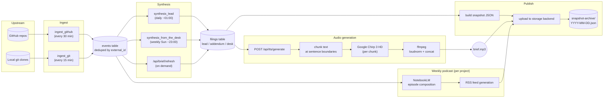
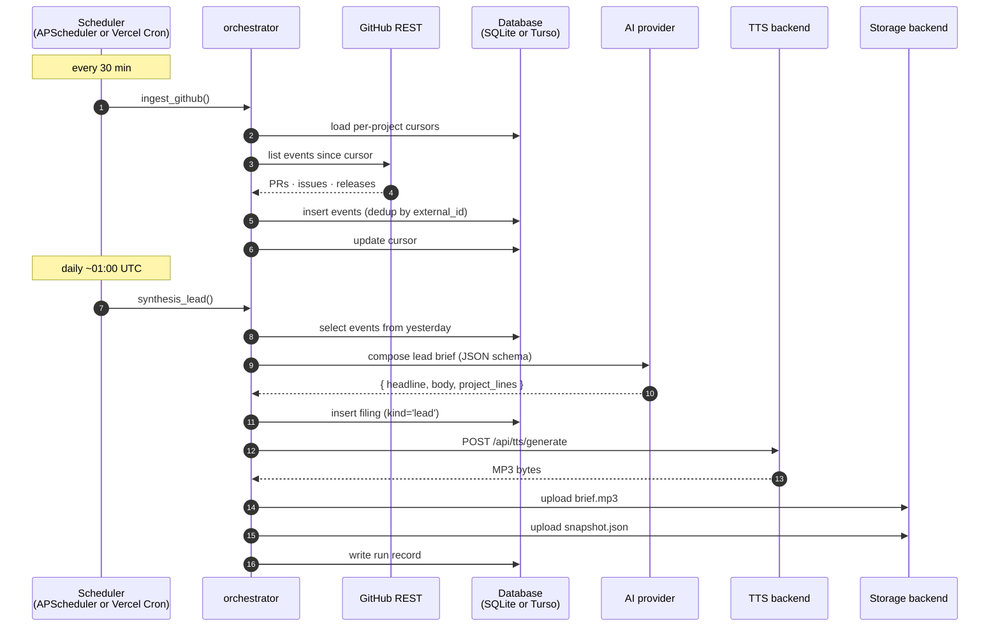
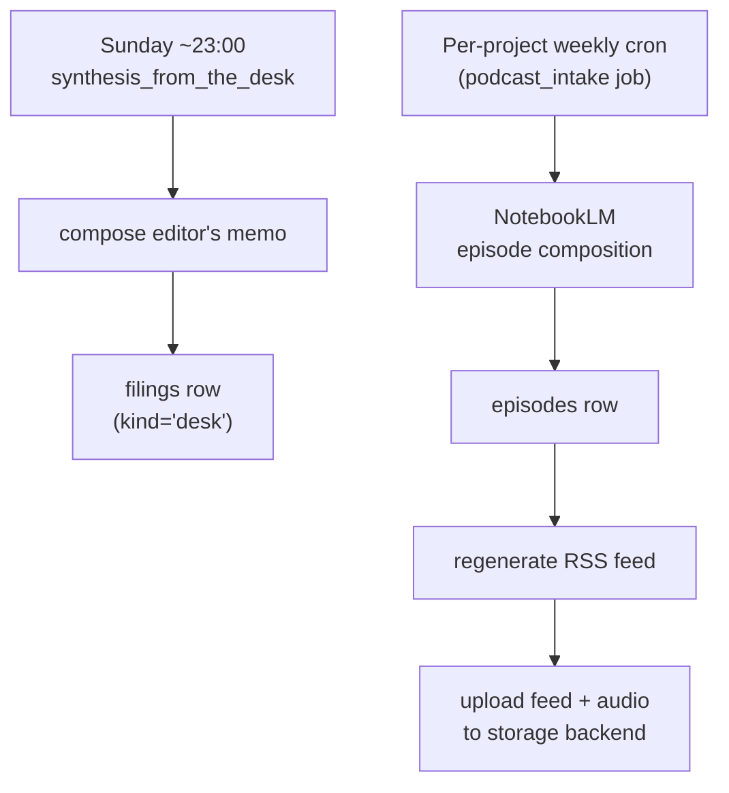
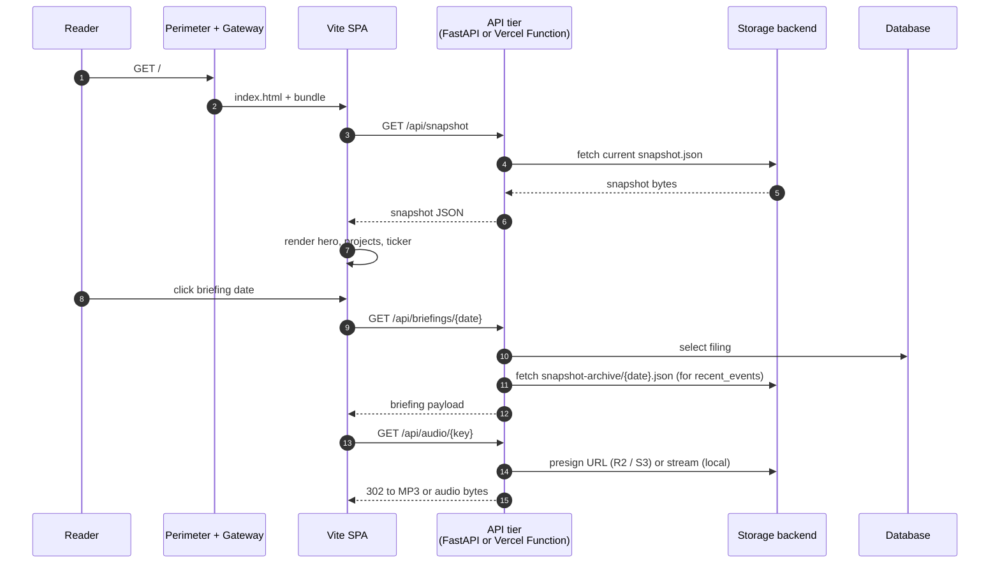
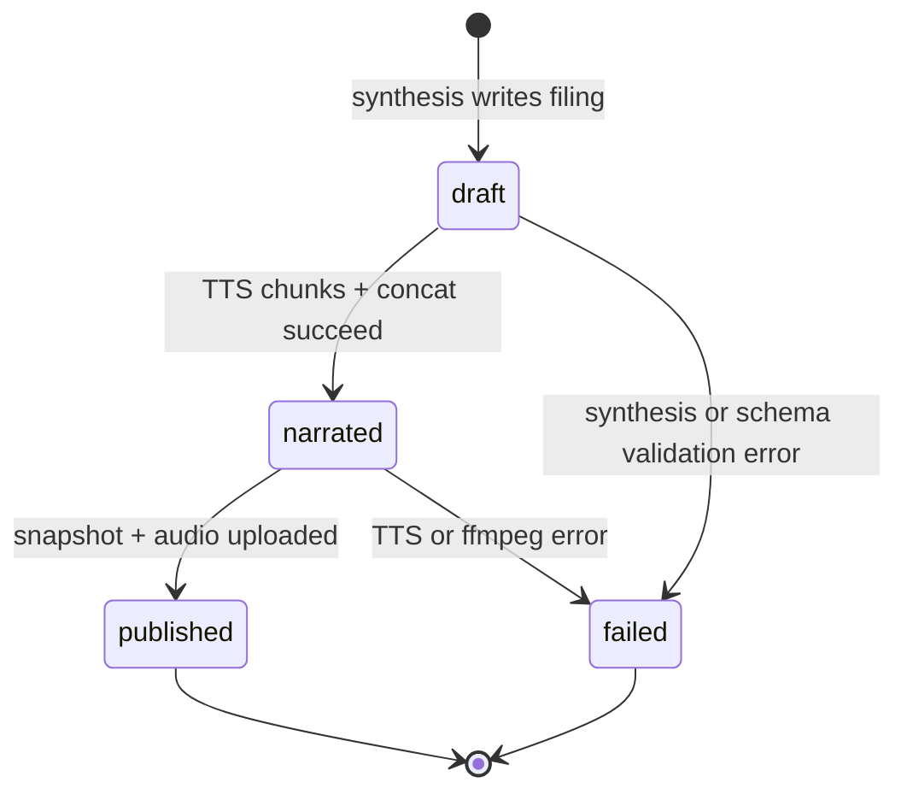
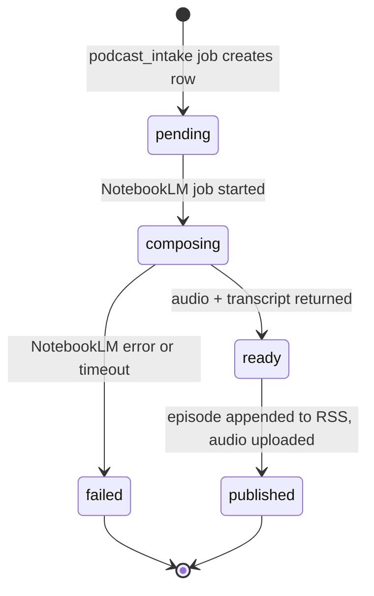

# Data Flow

Dispatch's job is to turn upstream development activity into a daily editorial
brief with audio, plus weekly podcast episodes. This document traces what
happens between a `git push` upstream and a reader opening the briefing page.

The pipeline is the same in both deployment modes; only the scheduler and
database differ:

- **All-in-One Docker:** APScheduler in-process + local SQLite
- **Hybrid (Vercel):** Vercel Cron Jobs + Turso (serverless SQLite over HTTP)

---

## End-to-end pipeline

---

## Daily cycle

Default cadence in UTC; adjust per-instance under `/admin/schedules`.

### On-demand addendum

Operators (or the SPA's "refresh" button) can trigger a same-day addendum
through `POST /api/brief/refresh`. The handler runs a compressed version of the
same pipeline with a 25-second timeout — synthesize, narrate, publish — and
attaches the result as an addendum filing to the day's brief.

---

## Weekly cycle

Weekly outputs:

- **From the desk** — a longer editorial memo summarizing the week's themes.
  Joins the next day's brief as a separate section.
- **Per-project podcast episode** — NotebookLM composes a conversational
  audio episode from the week's briefings touching that project. The RSS feed
  for the project is regenerated and re-uploaded.

---

## Reader read-path

Static SPA, hydrated from JSON snapshots written by the publish step:

The snapshot pattern keeps the read path independent of the synthesis path:
publishes are atomic file uploads, and the SPA only ever reads the current
snapshot plus any archived briefings the reader navigates to.

---

## Audio fallback chain

When a filing has no `audio_url` in the database (e.g., TTS failed or the
backend was down), the frontend falls back in this order:

1. **`audio_url` from database** — the canonical URL written by the audio step.
2. **Backend deterministic URL** — `https://<backend-host>/api/audio/dispatch/audio/{date}-lead.mp3`. The backend may have generated audio independently.
3. **Storage deterministic URL** — `{STORAGE_PUBLIC_BASE_URL}/dispatch/audio/{date}-lead.mp3`. Used when the frontend successfully uploaded to storage but failed to write the DB row.

The `<audio>` element handles 404s gracefully, so a missing fallback is a silent
no-op rather than a broken UI.

---

## State machines

### Briefing filings

Failures are recorded in the `runs` table with the error message, visible in
the admin Runs page.

### Podcast episodes

---

## Failure modes worth knowing

- **AI provider down** → synthesis job records a failed run; the previous
  day's brief stays visible. Operator can retry from the admin UI by editing
  the schedule or re-triggering via the orchestrator.
- **TTS quota exhausted** → filing is written but `narrated` step fails;
  briefing text is published without audio.
- **Storage backend unreachable** → publish step fails; the filing is already
  in the DB and will be picked up on the next successful publish.
- **Master key lost** → all encrypted settings (AI, TTS, GitHub, storage
  credentials) become unreadable; briefings, audio files, and snapshots are
  unaffected. Operator re-enters credentials through the setup wizard.
