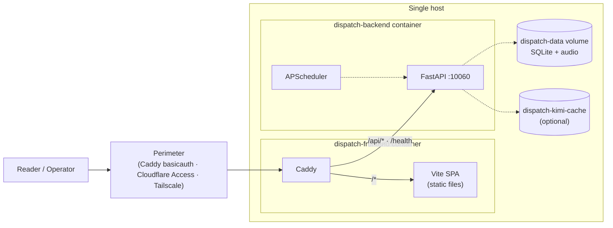
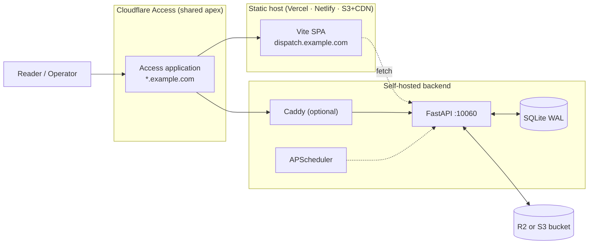
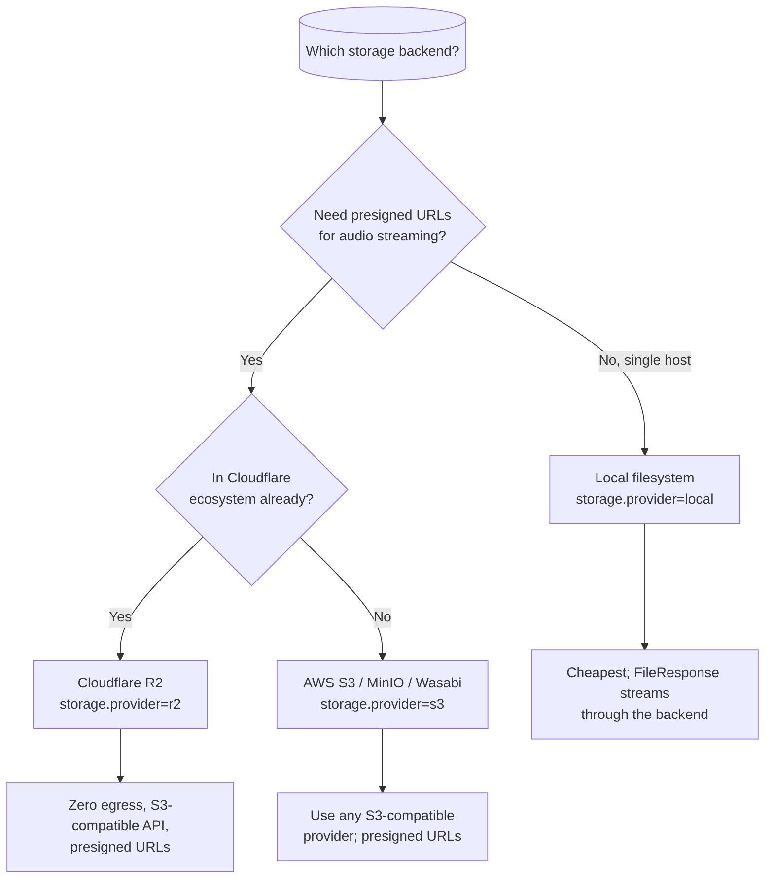

# Deployment

Dispatch is deliberately deployment-agnostic. The same backend image and the
same SPA bundle can run as a one-command all-in-one container, or split with
the SPA on a CDN and the backend on a homelab box. Auth is always provided by
the surrounding perimeter.

## Topology 1 — All-in-one Docker (default)

The fastest path. One `docker compose up`, one host, one container per service.



`docker-compose.yml` defines two services:

- **`dispatch-backend`** — FastAPI on internal port 10060 (not published).
  Mounts `dispatch-data:/data` for the SQLite DB and audio artifacts. Reads
  `DISPATCH_MASTER_KEY`, `DISPATCH_TZ`, `DB_PATH` from the environment.
- **`dispatch-frontend`** — Caddy + the built SPA. Publishes
  `${DISPATCH_HTTP_PORT:-8080}:80` and depends on the backend being healthy.

The Caddyfile sends `/api/*` and `/health` to `dispatch-backend:10060` and
serves everything else as a static SPA with a `try_files {path} /index.html`
fallback for React Router.

**Crucially, the backend has no published port.** It lives entirely inside the
Docker network. Caddy is the *gateway*: the single entry point for all external
traffic. The SPA in the browser calls `/api/...` relative to the same origin,
which Caddy routes to the backend. The backend is never exposed directly.

### One-command bring-up

```bash
export DISPATCH_MASTER_KEY=$(python -c "import secrets; print(secrets.token_urlsafe(32))")
docker compose up --build
```

Visit `http://localhost:8080/` for the SPA, `/health` for liveness,
`/api/projects` for a sample API response.

## Topology 2 — Split: static frontend + self-hosted backend

For when the operator wants the SPA on a CDN/Vercel and the backend on a
homelab box, VPS, or cloud VM.



Key configuration differences vs. all-in-one:

- Build the SPA with `VITE_DISPATCH_API_URL=https://api.example.com` so the
  bundle calls the right backend.
- Put both subdomains behind the **same** Cloudflare Access application so
  the auth cookie covers both. The SPA then calls the backend with
  `credentials: "include"`.
- Use R2 or S3 as the storage backend so audio and snapshots are served from
  a CDN-cached URL rather than a `FileResponse` on the backend host.

`apps/frontend/vercel.json` ships with **no hardcoded backend rewrite** — set
`VITE_DISPATCH_API_URL` at build time to point the SPA at your backend, or add
a `rewrites` block locally if you want to proxy through Vercel.

## Perimeter patterns

The app trusts whatever perimeter you put in front of it. Detailed recipes
live in [`../operations/perimeter-recipes.md`](../operations/perimeter-recipes.md);
the headline options:

| Pattern | Best for | Notes |
| --- | --- | --- |
| **Cloudflare Access** | Split topology with friends/family access | One application policy covers apex + subdomains; integrates with email, IdP, IP allowlists |
| **Tailscale Funnel** | Solo or small-team self-hosted | No public DNS / TLS work; only tailnet devices see the service |
| **Caddy basic auth** | All-in-one solo deployments | Single password hash, ships commented in the Caddyfile |
| **Authelia** | Multi-app homelab with SSO | Forward-auth in front of Caddy/Nginx; supports OIDC + 2FA |

The route prefix contract is the same for all of them: gate `/admin/*` and
`/api/admin/*`. Optionally also gate the public reader paths if the instance
is private.

## Storage backend choice



All three are interchangeable at runtime — switch by editing settings and
restarting. Existing audio paths are not migrated automatically; plan an
out-of-band copy if you switch backends after publishing content.

## Required and optional environment

| Variable | Required | Default | Notes |
| --- | --- | --- | --- |
| `DISPATCH_MASTER_KEY` | **Yes** | — | Refuses to boot without it. Derives the Fernet key for settings encryption. |
| `DISPATCH_TZ` | No | `UTC` | IANA timezone for scheduler cron expressions |
| `HOST` | No | `0.0.0.0` | uvicorn bind address |
| `PORT` | No | `10060` | uvicorn port |
| `DB_PATH` | No | `/data/dispatch.db` | SQLite file path |
| `VITE_DISPATCH_API_URL` | No | `/api` (relative) | Build-time override for the SPA |
| `DISPATCH_HTTP_PORT` | No | `8080` | Host port published by `dispatch-frontend` |

Every other credential — AI keys, TTS keys, GitHub PAT, storage credentials,
NotebookLM session — is set through the admin Settings page and stored
Fernet-encrypted in the `settings` table. There is no `.env`-based parallel
config for those; the admin UI is the single writer.

## Backups

`docs/operations/` (and the `/api/admin/system/backup-now` endpoint) describe
how to snapshot the SQLite file. The recommended baseline:

- Schedule a daily SQLite backup (built into the `housekeeping` job).
- Mirror the storage backend separately (R2 → second R2 region, or rclone for
  local-filesystem deployments).
- **Back up `DISPATCH_MASTER_KEY` in a password manager** — without it, all
  encrypted credentials are unrecoverable.
