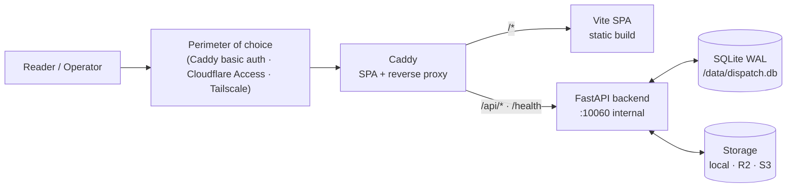
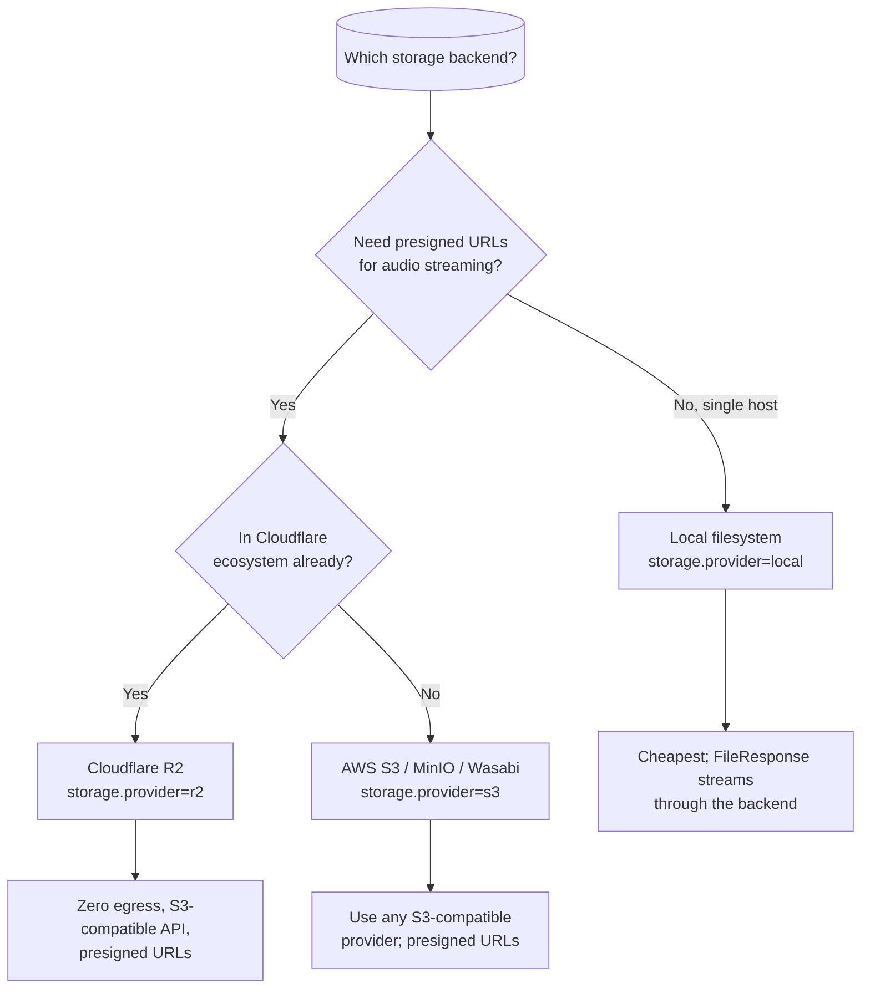
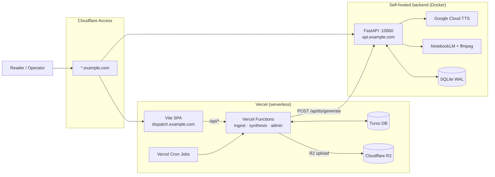

# Deployment

Dispatch supports two deployment topologies. Choose based on your
infrastructure and operational preferences.

| Topology | Best for | Complexity |
|----------|----------|------------|
| **All-in-One Docker** | Self-hosting, homelab, solo operator | Low |
| **Hybrid: Vercel + Self-Hosted Backend** | Serverless edge + heavy-work backend split | Medium |

---

## Topology A: All-in-One Docker (recommended)

A single `docker compose up` brings up the entire stack. Caddy serves the Vite
SPA, reverse-proxies API calls to the FastAPI backend, and handles TLS
(automatic with Let's Encrypt if you expose port 443).



### Why this topology

- **One container to run.** No platform lock-in, no external cron services.
- **One database to back up.** SQLite in WAL mode, with built-in automated
  backups via the `housekeeping` job.
- **One encryption key.** `DISPATCH_MASTER_KEY` is the only required secret.
  Everything else is configured through the admin UI and encrypted at rest.
- **Works offline.** The scheduler, TTS, and podcasts all run inside the
  container (TTS requires Google Cloud credentials, but the app itself needs no
  external platform).

### Quick start

```bash
# 1. Clone
 git clone https://github.com/markdavidgan/dispatch.git
 cd dispatch

# 2. Bootstrap (generates master key, builds, starts, backfills)
make bootstrap

# 3. Open http://localhost:8080
```

Override the host port with `DISPATCH_HTTP_PORT=9000 make bootstrap`.

See the root [`README.md`](../../README.md) for day-to-day `make` targets
(`up`, `down`, `logs`, `backfill`, etc.).

### Required environment variables

| Variable | Required | Notes |
|----------|----------|-------|
| `DISPATCH_MASTER_KEY` | **Yes** | Encrypts settings at rest. Generate with `make key`. |
| `GOOGLE_APPLICATION_CREDENTIALS` | **Yes** (for TTS) | Path to GCP service account JSON inside the container. Mount via `docker-compose.yml`. |
| `DB_PATH` | No | SQLite file path (default `/data/dispatch.db`) |
| `DISPATCH_TZ` | No | Timezone for scheduler (default `Asia/Manila`) |
| `HOST` | No | uvicorn bind (default `0.0.0.0`) |
| `PORT` | No | uvicorn port (default `10060`) |
| `DISPATCH_CORS_ORIGINS` | No | Comma-separated allowed origins for CORS |

All other credentials (AI provider keys, GitHub token, storage backend
configuration) are entered through the admin UI at `/admin/settings` and
encrypted in the SQLite database.

### Storage backend choice



All three are interchangeable at runtime — switch by editing settings and
restarting. Existing audio paths are not migrated automatically; plan an
out-of-band copy if you switch backends after publishing content.

### Perimeter patterns

The app trusts whatever perimeter you put in front of it. Detailed recipes live
in [`../operations/perimeter-recipes.md`](../operations/perimeter-recipes.md);
the headline options:

| Pattern | Best for | Notes |
| --- | --- | --- |
| **Caddy basic auth** | All-in-one solo deployments | Single password hash, ships commented in the Caddyfile |
| **Cloudflare Access** | Public demo with gated admin, or friends/family access | One application policy covers apex + subdomains |
| **Tailscale Funnel** | Solo or small-team self-hosted | No public DNS / TLS work; only tailnet devices see the service |
| **Authelia** | Multi-app homelab with SSO | Forward-auth in front of Caddy/Nginx; supports OIDC + 2FA |

The route prefix contract is the same for all of them: gate `/admin/*` and
`/api/admin/*`. Optionally also gate the public reader paths if the instance is
private.

### Backups

`docs/operations/` (and the `/api/admin/system/backup-now` endpoint) describe
how to snapshot the SQLite file. The recommended baseline:

- Schedule a daily SQLite backup (built into the `housekeeping` job).
- Mirror the storage backend separately (R2 → second R2 region, or rclone for
  local-filesystem deployments).
- **Back up `DISPATCH_MASTER_KEY` in a password manager** — without it, all
  encrypted credentials are unrecoverable.

---

## Topology B: Hybrid — Vercel + Self-Hosted Backend

The SPA and briefings API run on Vercel (serverless), while TTS and podcasts run
on a self-hosted backend. Auth is provided by the surrounding perimeter
(typically Cloudflare Access).



### Why this topology

| Concern | Vercel | Self-hosted backend |
|---|---|---|
| **GitHub ingest** | ✅ Pure HTTP, stateless | — |
| **AI synthesis** | ✅ Gemini/Groq API calls | — |
| **TTS** | ❌ No ffmpeg; serverless limits | ✅ Google Cloud TTS + ffmpeg |
| **Podcasts** | ❌ No long polling; no ffmpeg | ✅ NotebookLM + ffmpeg |
| **Audio serving** | ⚠️ R2 (cold cache) | ✅ Local FileResponse (fast) |

The backend shrinks to "TTS + podcast worker" — the Vercel tier owns ingest,
synthesis, snapshot publishing, and admin APIs.

### Why the split exists

Vercel serverless has no ffmpeg, no long-polling, and tight execution limits.
TTS and podcast pipelines need both. Rather than find a new TTS provider that
works serverless, Dispatch delegates audio work to the self-hosted backend over
HTTPS. See [ADR-001](adr/001-tts-on-marklab-backend.md).

### Vercel tier

- **SPA** — Built Vite bundle served from Vercel's edge CDN.
- **API Functions** — File-based routing in `apps/frontend/api/`. Each `.ts`
  file becomes a serverless function.
- **Cron Jobs** — Defined in `vercel.json`. Triggers ingest, synthesis, audio
  retry, and housekeeping.
- **Turso** — Serverless SQLite over HTTP. Stores projects, events, filings,
  settings (encrypted), runs, and schedules.
- **R2** — Cloudflare R2 bucket for snapshots and audio MP3s. Public base URL
  configured via `R2_PUBLIC_BASE_URL`.

### Self-hosted backend tier

- **Container** — Docker Compose on a Linux box (VPS, homelab, etc.).
- **Port** — `10060` published to the host so the reverse proxy / tunnel can
  reach it.
- **TTS** — Google Cloud Chirp 3 HD via `GOOGLE_APPLICATION_CREDENTIALS`.
  Exposed as `POST /api/tts/generate`.
- **Podcasts** — NotebookLM session management, 4-hour polling, ffmpeg DASH→MP3
  conversion, RSS feed generation.
- **Storage** — Local filesystem for audio files; R2 for snapshots if configured.
- **Database** — Local SQLite for podcast episodes, jobs, and NotebookLM sessions.

### Required environment variables

#### Vercel (frontend + API)

| Variable | Required | Notes |
| --- | --- | --- |
| `DISPATCH_MASTER_KEY` | **Yes** | Encrypts settings at rest. Same key as backend. |
| `TURSO_DATABASE_URL` | **Yes** | `libsql://...turso.io` |
| `TURSO_AUTH_TOKEN` | **Yes** | Turso DB auth token |
| `GEMINI_API_KEY` | **Yes** | Primary LLM (Gemini 2.5 Flash) |
| `R2_ACCOUNT_ID` | **Yes** | Cloudflare R2 account |
| `R2_ACCESS_KEY_ID` | **Yes** | R2 access key |
| `R2_SECRET_ACCESS_KEY` | **Yes** | R2 secret key |
| `R2_BUCKET` | **Yes** | R2 bucket name |
| `R2_PUBLIC_BASE_URL` | **Yes** | Public URL for R2 objects |
| `GITHUB_TOKEN` | **Yes** | GitHub PAT for ingest |
| `BACKEND_URL` | No | URL of the self-hosted backend (e.g. `https://api.example.com`) |
| `DISPATCH_TZ` | No | Timezone for cron scheduling (default `Asia/Manila`) |

#### Self-hosted backend (Docker)

| Variable | Required | Notes |
| --- | --- | --- |
| `DISPATCH_MASTER_KEY` | **Yes** | Same key as Vercel. |
| `GOOGLE_APPLICATION_CREDENTIALS` | **Yes** | Path to GCP service account JSON |
| `DB_PATH` | No | SQLite file path (default `/data/dispatch.db`) |
| `DISPATCH_TZ` | No | Timezone (default `Asia/Manila`) |
| `HOST` | No | uvicorn bind (default `0.0.0.0`) |
| `PORT` | No | uvicorn port (default `10060`) |

The backend also stores encrypted credentials (AI keys, storage, NotebookLM
session) in its local SQLite `settings` table. These are independent from the
Vercel settings store.

### CORS bootstrap for split deployments

Because the SPA and backend are on different origins, the backend must allow
the frontend origin in CORS. The easiest way is to set the env var at backend
boot time:

```bash
DISPATCH_CORS_ORIGINS=https://dispatch.example.com
```

(You can also set `web.allowed_origins` via the admin UI once you're in; the
env var is just there to avoid a chicken-and-egg problem on first deployment.)

### Cloudflare Access — public demo with gated admin routes

If you want the **reader-facing pages public** and only the **admin UI + admin
API** behind Cloudflare Access, create **two path-scoped Access applications**
on the same hostname:

| Application | Path | Policy |
|-------------|------|--------|
| Admin SPA | `dispatch.example.com/admin*` | Require identity (email allowlist, OTP, or IdP) |
| Admin API | `dispatch.example.com/api/admin*` | Same identity requirement |

Leave the root paths (`/`, `/briefings/*`, `/podcasts/*`, `/api/snapshot`,
etc.) uncovered — they pass through to the origin with no Access challenge.

**Why this works without code changes**

- The SPA (`/admin*`) and the backend (`/api/admin*`) live on the **same
  origin**, so the browser automatically sends the `CF_Authorization` cookie
  with every `fetch()` call. No `credentials: "include"` or CORS changes are
  needed.
- After the user authenticates through the Cloudflare Access login page, the
  cookie is valid for the entire domain.

**Hardening the origin**

Because the app is perimeter-trusting with no app-layer auth, anyone who
bypasses Cloudflare and hits the origin IP directly could reach `/api/admin/*`.
Lock down the origin server's firewall to **only Cloudflare IP ranges**:

- Cloudflare publishes its IP ranges at https://www.cloudflare.com/ips/
- Allow only those CIDR blocks on ports 80/443 (and your SSH port from your own
  IP).

---

## Choosing a topology

| If you... | Choose |
|-----------|--------|
| Want the simplest possible setup | **All-in-One Docker** |
| Run a homelab or VPS already | **All-in-One Docker** |
| Want zero platform dependency | **All-in-One Docker** |
| Already use Vercel for other projects | **Hybrid** |
| Want serverless scaling for ingest/synthesis | **Hybrid** |
| Need to share a TTS backend across multiple frontends | **Hybrid** |
| Have a slow/unreliable self-hosted uplink | **Hybrid** (Vercel edge handles API traffic) |
