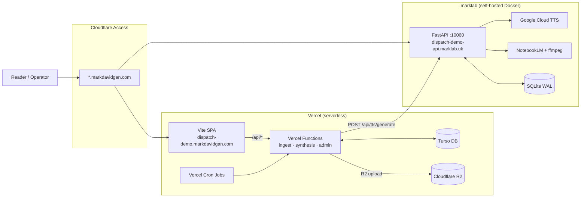
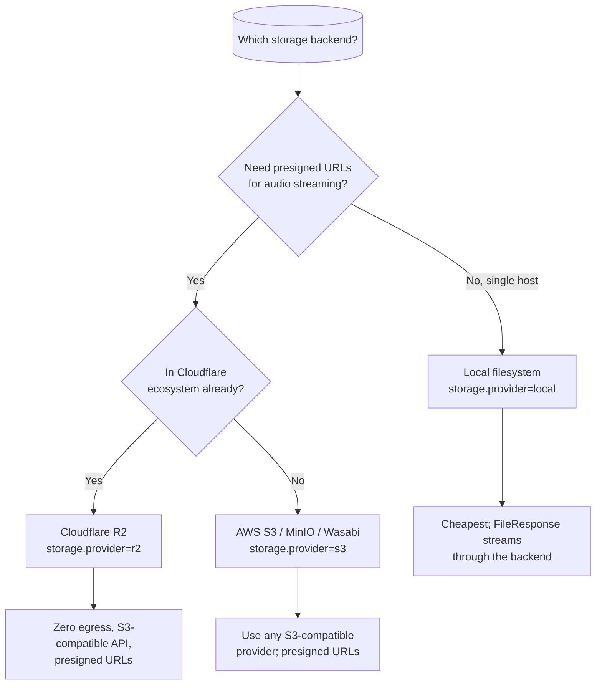

# Deployment

Dispatch is deployed as a **hybrid**: the SPA and briefings API run on Vercel
(serverless), while TTS and podcasts run on a self-hosted backend in Docker
(marklab). Auth is provided by the surrounding perimeter (Cloudflare Access).

## Topology — Hybrid: Vercel + marklab backend (production)

This is the current production deployment.

### Vercel tier

- **SPA** — Built Vite bundle served from Vercel's edge CDN.
- **API Functions** — File-based routing in `apps/frontend/api/`. Each `.ts`
  file becomes a serverless function.
- **Cron Jobs** — Defined in `vercel.json`. Triggers ingest, synthesis, audio
  retry, and housekeeping.
- **Turso** — Serverless SQLite over HTTP. Stores projects, events, filings,
  settings (encrypted), runs, and schedules.
- **R2** — Cloudflare R2 bucket for snapshots and audio MP3s. Public base URL
  configured via `R2_PUBLIC_BASE_URL`.

### marklab backend tier

- **Container** — Docker Compose on a local Linux box.
- **Port** — `10060` published to the host (`0.0.0.0:10060`) so the Cloudflare
  Tunnel can reach it.
- **TTS** — Google Cloud Chirp 3 HD via `GOOGLE_APPLICATION_CREDENTIALS`.
  Exposed as `POST /api/tts/generate`.
- **Podcasts** — NotebookLM session management, 4-hour polling, ffmpeg DASH→MP3
  conversion, RSS feed generation.
- **Storage** — Local filesystem (`./dispatch-media`) for audio files; R2 for
  snapshots if configured.
- **Database** — Local SQLite (`/data/dispatch.db`) for podcast episodes, jobs,
  and NotebookLM sessions.

### Why the split?

| Concern | Vercel | marklab |
|---|---|---|
| **GitHub ingest** | ✅ Pure HTTP, stateless | — |
| **AI synthesis** | ✅ Gemini/Groq API calls | — |
| **TTS** | ❌ No ffmpeg; HF Inference API dead | ✅ Google Cloud TTS + ffmpeg |
| **Podcasts** | ❌ No long polling; no ffmpeg | ✅ NotebookLM + ffmpeg |
| **Audio serving** | ⚠️ R2 (cold cache) | ✅ Local FileResponse (fast) |

The backend shrunk from "full API + scheduler" to "TTS + podcast worker", but
it remains essential. The Vercel frontend delegates to it over HTTPS.

## Perimeter patterns

The app trusts whatever perimeter you put in front of it. Detailed recipes
live in [`../operations/perimeter-recipes.md`](../operations/perimeter-recipes.md);
the headline options:

| Pattern | Best for | Notes |
| --- | --- | --- |
| **Cloudflare Access** | Split topology with friends/family access | One application policy covers apex + subdomains; integrates with email, IdP, IP allowlists |
| **Tailscale Funnel** | Solo or small-team self-hosted | No public DNS / TLS work; only tailnet devices see the service |
| **Caddy basic auth** | All-in-one solo deployments | Single password hash, ships commented in the Caddyfile |
| **Authelia** | Multi-app homelab with SSO | Forward-auth in front of Caddy/Nginx; supports OIDC + 2FA |

The route prefix contract is the same for all of them: gate `/admin/*` and
`/api/admin/*`. Optionally also gate the public reader paths if the instance
is private.

## Storage backend choice

All three are interchangeable at runtime — switch by editing settings and
restarting. Existing audio paths are not migrated automatically; plan an
out-of-band copy if you switch backends after publishing content.

## Required environment variables

### Vercel (frontend + API)

| Variable | Required | Notes |
| --- | --- | --- |
| `DISPATCH_MASTER_KEY` | **Yes** | Encrypts settings at rest. Same key as backend. |
| `TURSO_DATABASE_URL` | **Yes** | `libsql://...turso.io` |
| `TURSO_AUTH_TOKEN` | **Yes** | Turso DB auth token |
| `GEMINI_API_KEY` | **Yes** | Primary LLM (Gemini 2.5 Flash) |
| `R2_ACCOUNT_ID` | **Yes** | Cloudflare R2 account |
| `R2_ACCESS_KEY_ID` | **Yes** | R2 access key |
| `R2_SECRET_ACCESS_KEY` | **Yes** | R2 secret key |
| `R2_BUCKET` | **Yes** | R2 bucket name |
| `R2_PUBLIC_BASE_URL` | **Yes** | Public URL for R2 objects |
| `GITHUB_TOKEN` | **Yes** | GitHub PAT for ingest |
| `BACKEND_URL` | No | Defaults to `https://dispatch-demo-api.marklab.uk` |
| `DISPATCH_TZ` | No | Timezone for cron scheduling (default `UTC`) |

### marklab backend (Docker)

| Variable | Required | Notes |
| --- | --- | --- |
| `DISPATCH_MASTER_KEY` | **Yes** | Same key as Vercel. |
| `GOOGLE_APPLICATION_CREDENTIALS` | **Yes** | Path to GCP service account JSON |
| `DB_PATH` | No | SQLite file path (default `/data/dispatch.db`) |
| `DISPATCH_TZ` | No | Timezone (default `UTC`) |
| `HOST` | No | uvicorn bind (default `0.0.0.0`) |
| `PORT` | No | uvicorn port (default `10060`) |

The backend also stores encrypted credentials (AI keys, storage, NotebookLM
session) in its local SQLite `settings` table. These are independent from the
Vercel settings store.

## Backups

`docs/operations/` (and the `/api/admin/system/backup-now` endpoint) describe
how to snapshot the SQLite file. The recommended baseline:

- Schedule a daily SQLite backup (built into the `housekeeping` job).
- Mirror the storage backend separately (R2 → second R2 region, or rclone for
  local-filesystem deployments).
- **Back up `DISPATCH_MASTER_KEY` in a password manager** — without it, all
  encrypted credentials are unrecoverable.
