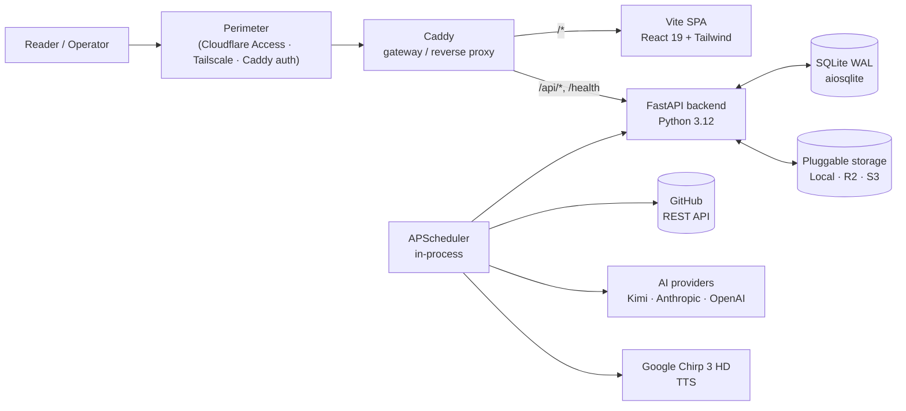

# Dispatch Architecture

A self-hosted daily editorial brief generator. Watches a configurable registry
of GitHub repositories, synthesizes a daily brief with audio narration, and
publishes weekly podcasts — all driven by an encrypted-at-rest configuration
store and a deployment perimeter that the app trusts for authentication.

These docs describe the system as it exists in this repository.

## Documents

| Doc | What it covers |
| --- | --- |
| [`ARCHITECTURE.md`](ARCHITECTURE.md) | System overview, components, route map, settings encryption, pluggable storage, scheduler |
| [`DATA-FLOW.md`](DATA-FLOW.md) | Ingest → synthesis → audio → publish pipeline; daily and weekly cycles |
| [`DEPLOYMENT.md`](DEPLOYMENT.md) | All-in-one Docker, split Vercel + self-hosted backend, perimeter-auth patterns |
| [`diagram.html`](diagram.html) | Self-contained interactive showcase diagram (open in a browser) |

## North-star invariants

1. **No app-layer authentication.** The backend trusts its deployment perimeter
   (Cloudflare Access, Tailscale, Caddy basic auth, Authelia). Admin routes are
   prefix-gated (`/admin/*`, `/api/admin/*`) so any HTTP-level policy works.
   In the all-in-one topology, Caddy is the **gateway** — the only published
   service; the backend has no external port.
2. **One required env var.** `DISPATCH_MASTER_KEY`. Every other credential lives
   in the DB, encrypted with Fernet derived from the master key.
3. **Deployment-agnostic.** Ship as a single `docker compose up`, or split the
   static frontend onto a CDN/Vercel and self-host the backend. Same image.
4. **Single admin per instance.** No multi-tenancy, no RBAC, no users table.
5. **Editorial design is immutable.** See [`../../DESIGN.md`](../../DESIGN.md).
   Framework can change; the look cannot.

## TL;DR diagram

